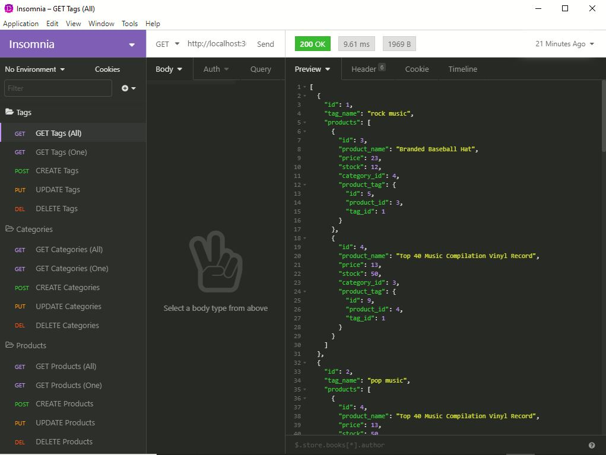

# E-commerce Back End

# License
  

  

# Table of Contents

- [Description](#description)
- [Installation](#installation)
- [Test](#test)
- [Usage](#usage)
- [Links](#links)
- [Questions](#questions)
- [Screenshot](#screenshot)

# Description
This is an e-commerce back end database.  A company can use this application to organize and update their product inventory.  This database is powered by Insomnia REST Client.

# Built With
- Javascript
- NPM express
- Node.js
- Sequelizer
- Insomnia REST Client
- dotenv package
- MySql

# Installation
Cloning of the repository is required.  For testing purposes, also download <a href="https://insomnia.rest/">Insomnia</a>.
This E-commerce Back End is terminal and Insomnia based application.

# Test
- Clone the repository.
- Install npm in the root folder with 'npm install'
- Edit the .env file in the root folder, write your username and password for MySQL.
- Activate MySQL terminal and type 'source db/schema.sql', once activated quit the terminal.
- Seed data to your database by inputting 'npm run seed'
- Start the test with 'npm start'
- Walkthrough Screencastify: <a href="https://youtu.be/Oy13RWgMmZ8">Click Me To Watch</a>.  This screencast is a walkthrough of creating a schema through MySQL shell, seeding the database from the command line.  Operating Insomnia by demonstrating GET routes for all categories, products and tags.  Also demonstrating GET routes for a single category, product and tag.

# Usage
- Navigate Insomnia to GET, CREATE, UPDATE and DELETE product/category/tag in the database.
- GET is to GET (All product/category/tag list)
- GET is to GET (ONE product/category/tag)
- CREATE is to ADD a new product/category/tag
- UPDATE is to UPDATE an existing product/category/tag
- DELETE is to REMOVE an existing product/category/tag
- Walkthrough Screencastify: <a href="https://youtu.be/nhja4uGKRGQ">Click Me To Watch</a>.  This screencast is powered by Insomnia.  This is a walkthrough of the POST, PUT, and DELETE for categories, products and tag.

# Links
- Link to repository: https://github.com/itsrheine/ecommerce-backend

# Questions
If you have any questions or concerns, please feel free to reach out to my:
- Email: [mtiamsic@gmail.com](mtiamsic@gmail.com)
- Github: [itsrheine](https://github.com/itsrheine)

# Screenshot

